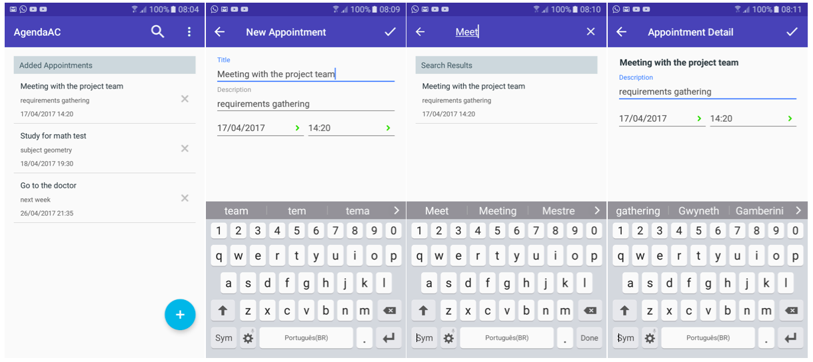

# Agenda App #

Aplicativo Android para organizar a agenda de compromissos do usuário.

### Telas ###

<h3 align="center">
  
</h3>

### Sobre ###

O desafio consistiu na criação de um aplicativo que gerenciasse as informações de uma agenda de compromissos, tendo como pré-requisito a autenticação do usuário. Tanto para a autenticação quanto para o armazenamento e sincronização dos dados na nuvem foi utilizado o [Firebase](https://firebase.google.com/). Para notificar o usuário com lembretes de um compromisso e permitir ajustes diversos como o tempo de antecedência do alerta, o aplicativo se integra com o Google Agenda (Calendar).    

### Requisitos ###

* Smartphone Android rodando o Google Play Services 9.0.0 ou superior
* Google Play Services instalado no Android SDK Manager
* Android Studio 1.5 ou superior
* App Google Agenda

### Dependências ###
* Firebase Auth
* Firebase Database
* Calligraphy

### Instalação ###

* Clone o projeto do bitbucket:
   ```
   git clone https://frbentes@bitbucket.org/frbentes/agendaac.git
   ```
* Importe o projeto no Android Studio: **File > New > Import Project**. Ou na tela de boas-vindas selecione **Import project**.

### Contato ###

* Fredyson Costa ([@frbentes](https://github.com/frbentes))